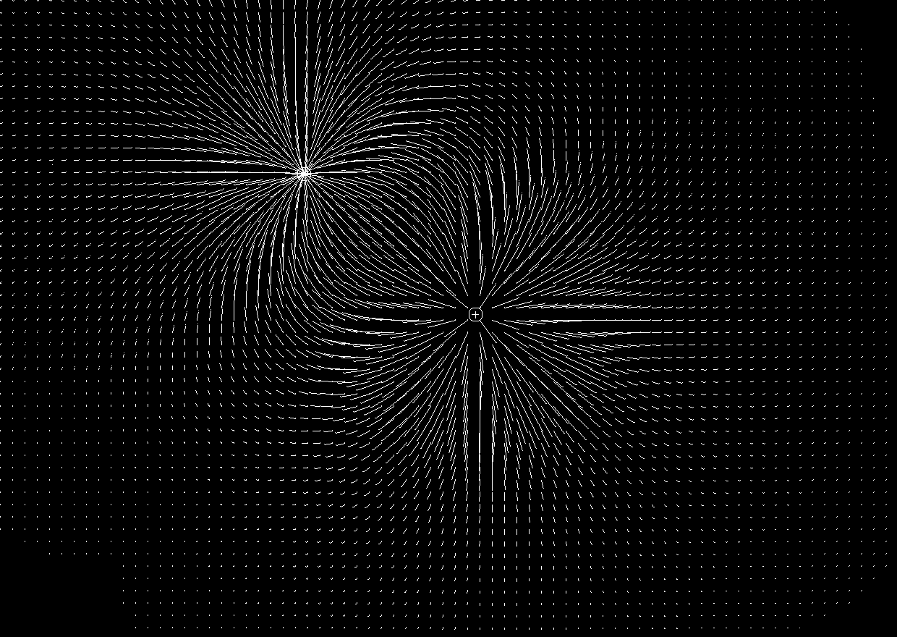
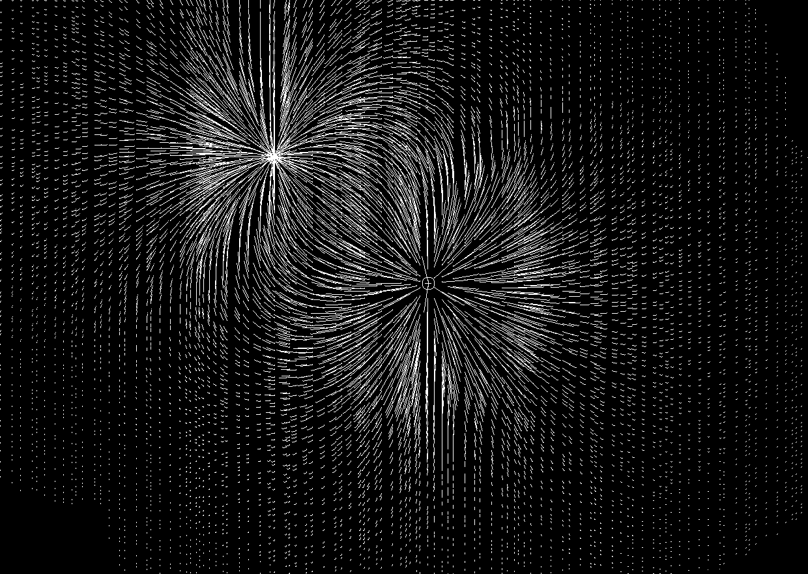
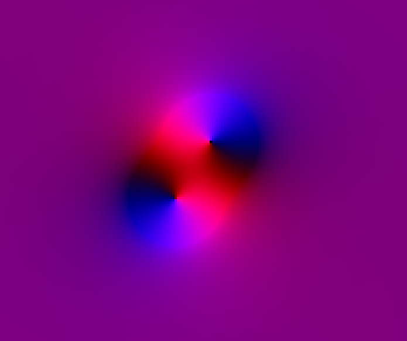

# ElectricFields
Interactive utility for visualizing the electrostatic field created by two differently charged particles. Modes can be switched using space bar.

Default Mode

Random Samping Mode

RB=xy Vector Color Mode

